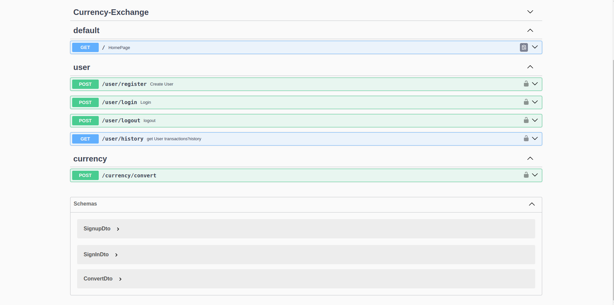
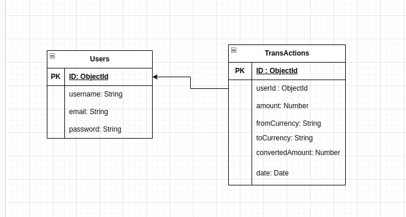

<p align="center">
  <a href="http://nestjs.com/" target="blank"></a>
</p>

[circleci-image]: https://img.shields.io/circleci/build/github/nestjs/nest/master?token=abc123def456
[circleci-url]: https://circleci.com/gh/nestjs/nest

## Currency Exchange API

This repository contains the source code for the Currency Exchange API, which allows users to convert currency amounts, manage user accounts, and view transaction history.

### Prerequisites

Before running the application, ensure you have the following prerequisites installed on your system:

- Node.js
- MongoDB

# Installation

##Clone the repository to your local machine:

```bash
git clone https://github.com/your-username/currency-exchange-api.git
```

##Navigate to the project directory:

```bash
cd currency-exchange-api
```

##Install dependencies:

```bash
npm install
```

Configuration.
Set up environment variables:<br>
Create a .env file in the root directory.<br>
Add the following environment variables:

```bash
PORT=3000
MONGODB_URI=<your_mongodb_connection_string>
JWT_SECRET=<your_jwt_secret_key>
```

##Running the Application
To start the server, run the following command:

```bash
npm start
```

The server will start listening on port 3000 by default.<br> You can access the API at http://localhost:3000.

##Testing

To run unit tests, use the following command:

```bash
npm test
```

## Swagger Documentation

The Currency Exchange API provides Swagger documentation for easy exploration and testing of the API endpoints. Follow the steps below to access the Swagger documentation:

1. Ensure that the Currency Exchange API server is running on your local machine or a remote server.

2. Open your web browser and navigate to the Swagger UI endpoint: [http://localhost:3000/api-docs](http://localhost:3000/api-docs). Replace `localhost:3000` with the appropriate server address if running on a remote server.

3. You will see the Swagger UI interface, which displays a list of available endpoints, request/response formats, and allows you to interact with the API.

4. Explore the available endpoints, make requests, and view the responses directly from the Swagger UI interface. This is a convenient way to test the API functionalities.



## Database Diagram

The following diagram illustrates the database schema for the Currency Exchange API:



## Project Repository Link:

Explore the Project

You can find the project repository [here](http://34.245.237.26). This repository contains the source code and documentation for the project, allowing you to view, contribute, and collaborate on the development of the project.
